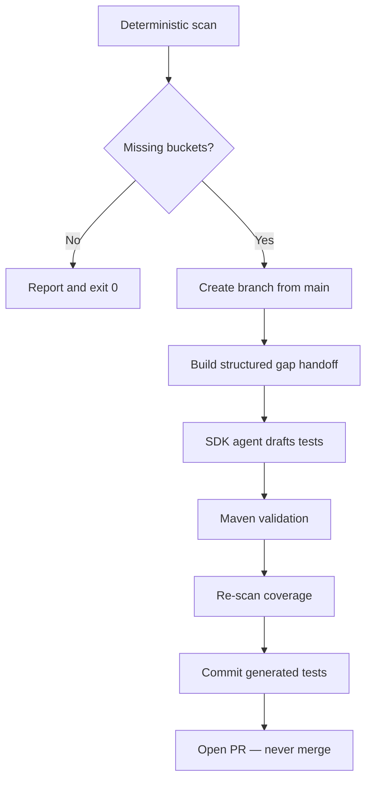

# Taxonomy Coverage

Measure how completely the test suite covers the five taxonomy categories and whether
every client call site in `inventory.json` has contract test coverage.

## Two Modes

| Mode | Command | Purpose |
|------|---------|---------|
| **Gate (deterministic)** | `npm run taxonomy-coverage:local` | Pass/fail exit code for CI or cutover gates |
| **Remediation (SDK)** | `npm run taxonomy-coverage` | Detect gaps → branch → draft tests → validate → open PR |

The skill documents the deterministic gate. The SDK runner handles agent-authored remediation.

## Taxonomy Categories

Source of truth: `src/test/java/com/migration/support/TestTaxonomy.java`

| Category | Package | Pattern | Primary question |
|----------|---------|---------|------------------|
| CONTRACT | `com.migration.contract` | `*ContractTest` | Legacy API JSON parity |
| ROUTING | `com.migration.routing` | `*Test` | Correct store routing |
| TRANSFORM | `com.migration.transform` | `*TransformerTest` | Deterministic mappings |
| MIGRATION | `com.migration.migration` | `*Test` | Backfill workflow |
| SMOKE | `com.migration` | `MigrationShimApplicationTests` | Context startup |

## Deterministic Steps (Gate Mode)

1. **Run the local checker**:
   ```bash
   npm run taxonomy-coverage:local
   ```
   Or with JSON output:
   ```bash
   npm run taxonomy-coverage:local -- --json
   ```

2. **Core modules**:
   - `scripts/taxonomy-coverage-core.ts` — scenario-level bucket matrix (31 buckets), percent calculation
   - `scripts/coverage-check-core.ts` — inventory.json call-site → contract test mapping

3. **Contract call-site layer** — match each inventory entry by **`method + endpoint`**.

4. **Emit a structured report** (see Output Format below).

## SDK Remediation Flow

When gaps exist, `npm run taxonomy-coverage` (without `--local-only`):



Flags:
- `--dry-run` — print gap handoff and agent prompt without branching
- `--no-pr` — generate and commit tests but skip PR creation
- `--json` — machine-readable output

Requires: `CURSOR_API_KEY`, clean git working tree, `gh` CLI for PR creation.

## Contract Endpoint Mapping

| Method | Endpoint | Contract Test Class |
|--------|----------|---------------------|
| GET | `/products/{id}` | `GetProductByIdContractTest` |
| GET | `/orders/{id}` | `GetOrderByIdContractTest` |
| GET | `/orders?customer_id={customer_id}` | `GetOrdersByCustomerIdContractTest` |
| POST | `/orders` | `PostOrderContractTest` |
| GET | `/customers` | `GetCustomersContractTest` |
| GET | `/customers/{id}` | `GetCustomerByIdContractTest` |
| GET | `/orders` | `GetOrdersContractTest` |
| GET | `/orders/{id}/status` | `GetOrderStatusContractTest` |
| GET | `/customers/{id}/orders` | `GetCustomerOrdersContractTest` |

## Output Format

```json
{
  "taxonomy_coverage_percent": 100,
  "total_buckets": 31,
  "implemented_buckets": [],
  "missing_buckets": [],
  "by_category": {
    "CONTRACT": { "total": 10, "implemented": 10, "percent": 100 },
    "ROUTING": { "total": 6, "implemented": 6, "percent": 100 },
    "TRANSFORM": { "total": 7, "implemented": 7, "percent": 100 },
    "MIGRATION": { "total": 7, "implemented": 7, "percent": 100 },
    "SMOKE": { "total": 1, "implemented": 1, "percent": 100 }
  },
  "contract_call_sites": {
    "total_call_sites": 12,
    "covered_call_sites": [],
    "uncovered_call_sites": [],
    "covered_endpoints": [],
    "missing_endpoints": [],
    "stub_test_suggestions": []
  }
}
```

## Decision Rule

- **Pass:** `missing_buckets` is empty **and** `contract_call_sites.uncovered_call_sites` is empty.
- **Fail:** any missing taxonomy bucket or uncovered inventory call site.

## Guardrails

- Deterministic code decides coverage truth; SDK agent only drafts tests.
- No MongoDB MCP during remediation.
- PR creation is the terminal action — **never auto-merge**.
